# heatmap

## Usage

### `drawHeatmap({points, width, height, [...args]}) ⇒ Buffer`

Returns the `Buffer` of a `png` image of the heatmap. The `points` argument must be an `Array` containing the following properties: The center of the point `px`, `py`, The intensity of the point `value`. The range of values that makes the gradient are from 0 to 1, but it's possible to give values outside this range. Also, additional arguments can be given to overwrite the defaults for the _kernel_ configuration.

#### Example

```javascript
const fs = require("fs");
const heatmap = require("@luxedo/heatmap");

const points = [
  {
    px: 10,
    py: 10,
    value: 1,
    sigma: 30
  },
  {
    px: 120,
    py: 30,
    value: 0.6,
    sigma: 50
  },
  {
    px: 70,
    py: 130,
    value: 0.2,
    sigma: 70
  }
];
const width = 150;
const height = 150;
const buf = heatmap.drawHeatmap(points, width, height);
fs.writeFileSync("example1.png", buf);
```

##### example1.png


### `drawGeoHeatmap({geoCoords, geoPoints, (pxPerDeg || (width | height)), [...args]}) ⇒ {buf (Buffer), origin (Object), end (Object)}`

Returns an object with the `Buffer` (buf) of a `png` image of the heatmap, the northwestmost and southeastmost (origin, end) coordinates `{lat, lng}`. Inputs are `geoCoords` the boundaries of the image, an `Array` of coordinates `{lat, lng}`; and `geoPoints`, an `Array` of `{lat, lng, value}`, configuration is similar to `deawHeatmap`. One of: `pxPerDeg`, `width`, `height` must be provided.

```javascript
const geoCoords = [
  {
    lat: 0.0,
    lng: 0.0
  },
  {
    lat: 0.3,
    lng: 0.3
  }
];
const geoPoints = [
  {
    lat: 0.1,
    lng: 0.1,
    value: 1,
    sigma: 40
  },
  {
    lat: 0.1,
    lng: 0.2,
    value: 0.6,
    sigma: 40
  },
  {
    lat: 0.15,
    lng: 0.2,
    value: 0.2,
    sigma: 100
  }
];
const pxPerDeg = 500;
const method = "max";
const buf = heatmap.drawGeoHeatmap({ geoCoords, geoPoints, pxPerDeg, method });
fs.writeFileSync("example2.png", buf);
```

#### example2.png

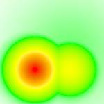

#### Arguments

##### `drawHeatmap`:

- `points`: `Array` of points to draw `[{px, py, value}]`.
- `width`: width of the image.
- `height`: height of the image.
- `colors`: Either an `Object` for colormap configuration, or a `String` of a default colormap. Options: `teelights`, `jet`, `parula`, `gray`, `magma`, `plasma`, `inferno`, `viridis`.
- `cropPolygon`: `Array` of points `[{px, py}]` forming a polygon to crop the output image
- `kernel`: The RBF kernel for computing the intensity of the heatmap. Options: `bump`, `cosine`, `dampedCosine`, `exponential`, `gaussian`. `linear`, `polynomial`, `step`.
- `method`: The method for accumulating the intensities. Options: `max`, `nearest`, `shepards`, `sum`.
- `methodArgs`: Additional arguments for the `method`.

##### `drawGeoHeatmap`:

- `geoCoords`: `Array` of coordinates `[{lat, lng}]` of the boundaries of the heatmap. May also be used with `crop` when passing more than three coordinates to select the polygon inside the coordinates.
- `geoPoints`: `Array` of points to draw `[{lat, lng, value}]`.
- `pxPerDeg`: Number of pixels per degree of latitude/longitude. To use this scaling mode neither `width` and `height` can be provided.
- `width`: Forces the image to have a certain width. Can be used alongside with `height`.
- `height`: Forces the image to have a certain height. Can be used alongside with `width`.
- `colors`: Either an `Object` for colormap configuration, or a `String` of a default colormap. Options: `teelights`, `jet`, `parula`, `gray`, `magma`, `plasma`, `inferno`, `viridis`.
- `crop`: Crops the polygon of the boundaries gven in `geoCoords` if `true`.
- `kernel`: The RBF kernel for computing the intensity of the heatmap . Options: `bump`, `cosine`, `dampedCosine`, `exponential`, `gaussian`. `linear`, `polynomial`, `step`.
- `method`: The method for accumulating the intensities. Options: `max`, `nearest`, `shepards`, `sum`.
- `methodArgs`: Additional arguments for the `method`.

### Command line

```bash
$ heatmap --help
Usage: heatmap [-g] -i input_file -o output_file       heatmap [-g] [--] file

Options:
  --help        Show help                                              [boolean]
  --version     Show version number                                    [boolean]
  --geo, -g     Receives input as geographic data                      [boolean]
  --input, -i   Input json file with the configurations                 [string]
  --output, -o  Output png file                                         [string]
  --            Receives input from stdin and outputs to stdout

Example:
echo '{"points": [{"px": 10, "py": 10, "value": 1, "sigma": 30},
  {"px": 120, "py": 30, "value": 0.6, "sigma": 50},
  {"px": 70, "py": 130, "value": 0.2, "sigma": 70}],
  "width": 150,
  "height": 150,
  "method": "nearest"}' | bin/heatmap -- > example3.png

   See ... for configuration details.
```

#### example3.png

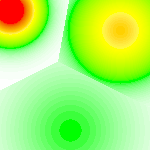

## Installation

### Node

Install via `npm`:

```bash
$ npm install @luxedo/heatmap
```

### Browser

Include the script from [jsDelivr](https://jsdelivr.com):

```html
<script src="https://cdn.jsdelivr.net/npm/@luxedo/heatmap@1.0.0/heatmap.min.js"></script>
```

## Kernels

There are 8 kernels used as [Radial Basis Functions](https://en.wikipedia.org/wiki/Radial_basis_function) for determining the intensity of each pixel in the heatmap:

| []()                                          |                                           |                                                       |                                                     |
| --------------------------------------------- | ----------------------------------------- | ----------------------------------------------------- | --------------------------------------------------- |
| **bump**                                      | **cosine**                                | **dampedCosine**                                      | **exponential**                                     |
|          |  |  | 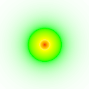 |
| **gaussian**                                  | **linear**                                | **polynomial** degree 2                               | **step**                                            |
|  |  |      |                |

### bump

##### arguments:

- `radius`: Radius of the bump

### cosine

##### arguments:

- `omega`: Angular frequency
- `phi`: Phase

### dampedCosine

##### arguments:

- `omega`: Angular frequency
- `phi`: Phase
- `epsilon`: Decay

### exponential

##### arguments:

- `epsilon`: Decay

### gaussian

##### arguments:

- `sigma`: Standard deviation

### linear

##### arguments:

- `epsilon`: Decay

### polynomial

##### arguments:

- `epsilon`: Decay
- `degree`: Degree of the polynomial

### step

##### arguments:

- `radius`: Radius of the step

## Methods

There are 4 methods for accumulating the values of the points

| []()                                 |                                          |                                           |                                      |
| ------------------------------------ | ---------------------------------------- | ----------------------------------------- | ------------------------------------ |
| **max**                              | **nearest**                              | **shepards**                              | **sum**                              |
| 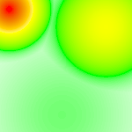 | 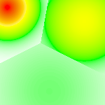 |  | 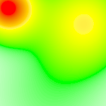 |

### max

Gets the maximum value of any point

### nearest

Gets the value for the nearest point

### shepards

Computes a weighted sum of the points using a kernel.

##### arguments:

- `kernel`: Name of the kernel
- `kernelArgs`: Extra arguments for the kernel

### sum

Sums the values of all points.

## Colors

The first option for configuring the colormap is by chosing one of the default colors:

| []() | | | |
| --------------------------------------------- | ----------------------------------------- | ----------------------------------------------------- | --------------------------------------------------- |
| **teelights** default | **jet** | **parula** | **gray** |
|  |  |  |  |
| **magma** | **plasma** | **inferno** |  **viridis** |
| 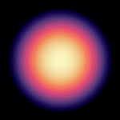 |  |  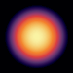 |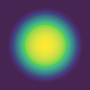 |

The second option is an `Object` containing the following _properties_:

- `steps`: Number of colors for interpolation.
- `colors`: An `Array` of the colors in the colormap in hex.
- `weights`: An `Array` of weights for each color (optional).

#### Example

```javascript
const fs = require("fs");
const heatmap = require("@luxedo/heatmap");

const points = [
  {
    px: 10,
    py: 10,
    value: 1,
    sigma: 30
  },
  {
    px: 120,
    py: 30,
    value: 0.6,
    sigma: 50
  },
  {
    px: 70,
    py: 130,
    value: 0.2,
    sigma: 70
  }
];
const width = 150;
const height = 150;

let colors = {
  steps: 30,
  values: ["#111122", "#44AA11", "#DDDDFF"],
  weights: [1, 2, 3]
};
buf = heatmap.drawHeatmap({ points, width, height, colors });
fs.writeFileSync("example4.png", buf);
```

#### example4.png


## Examples

| kernel       | max                                                    | nearest                                                        | shepards                                                         | sum                                                    |
| ------------ | ------------------------------------------------------ | -------------------------------------------------------------- | ---------------------------------------------------------------- | ------------------------------------------------------ |
| bump         |                  | 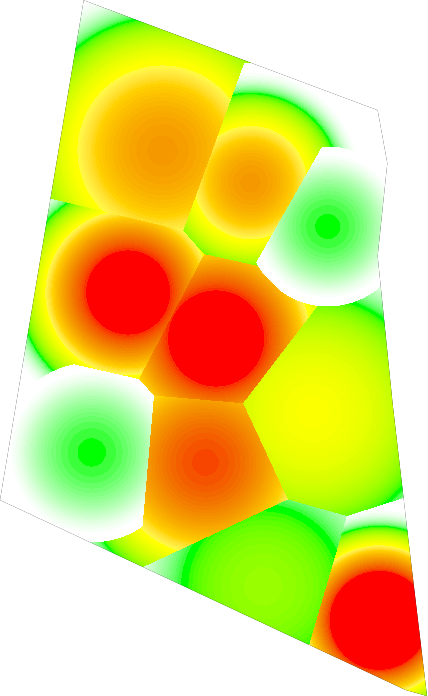                 | 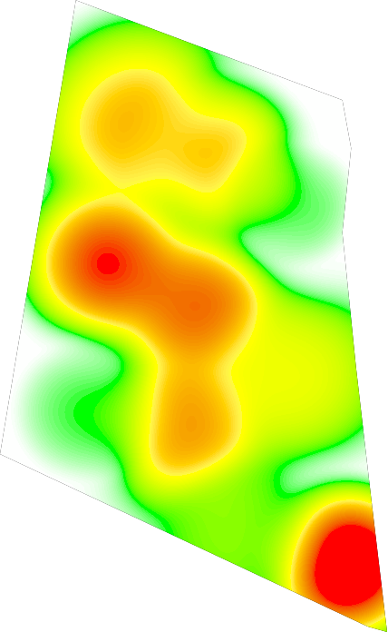                 |                  |
| cosine       |              |              | 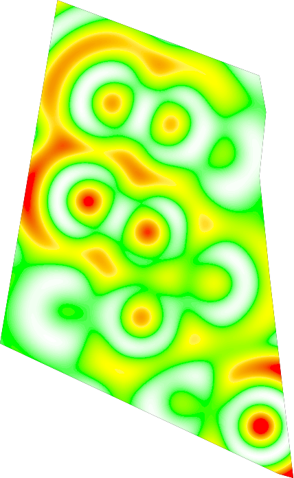             |              |
| dampedCosine |  |  | 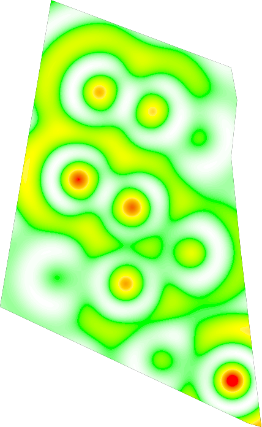 |  |
| exponential  |    |    |    | 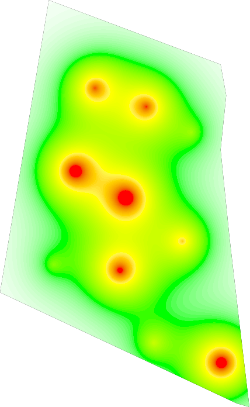   |
| gaussian     | 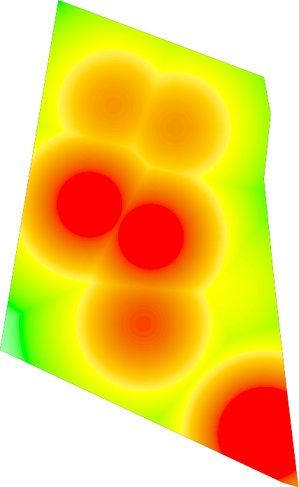         |          |          | 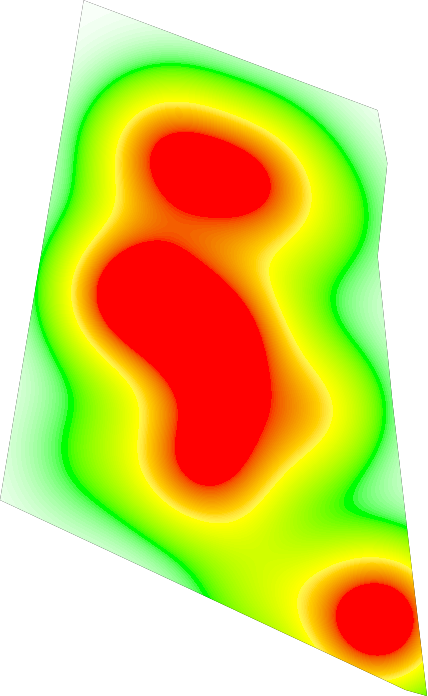         |
| linear       |              |              |              | 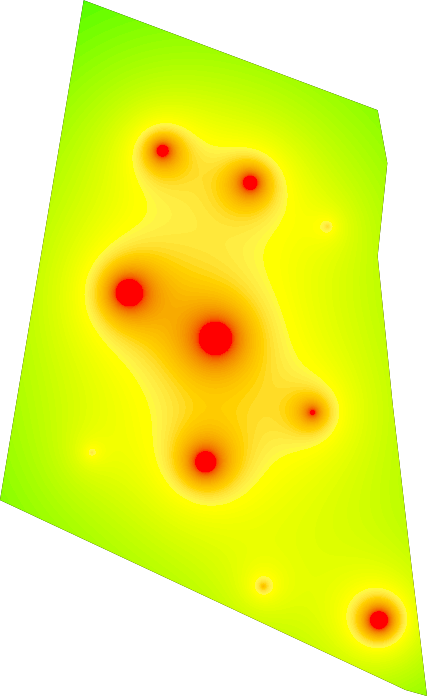             |
| polynomial   | 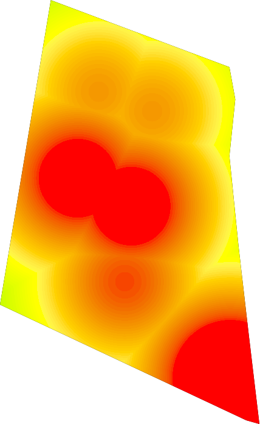     |      | 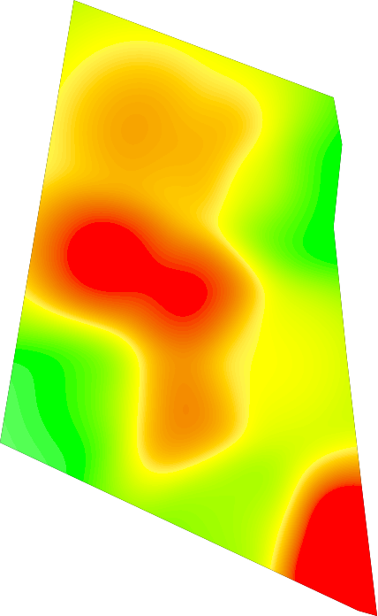     |      |
| step         | 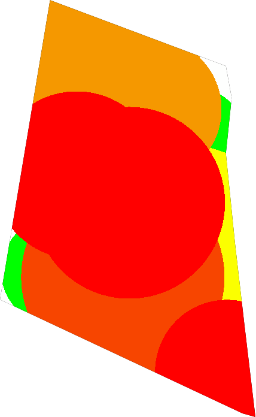                 |                  |                  | 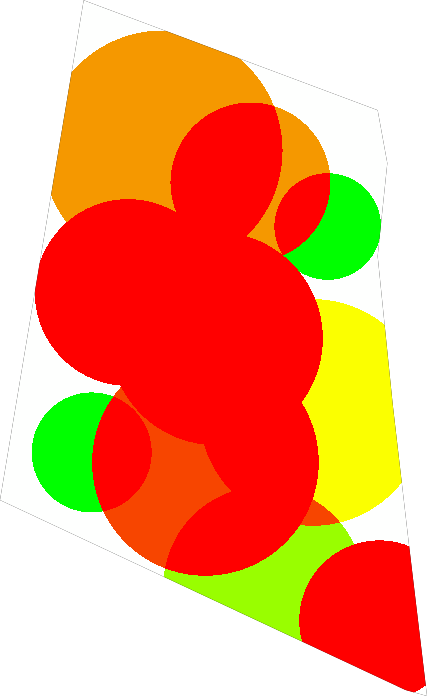                 |
